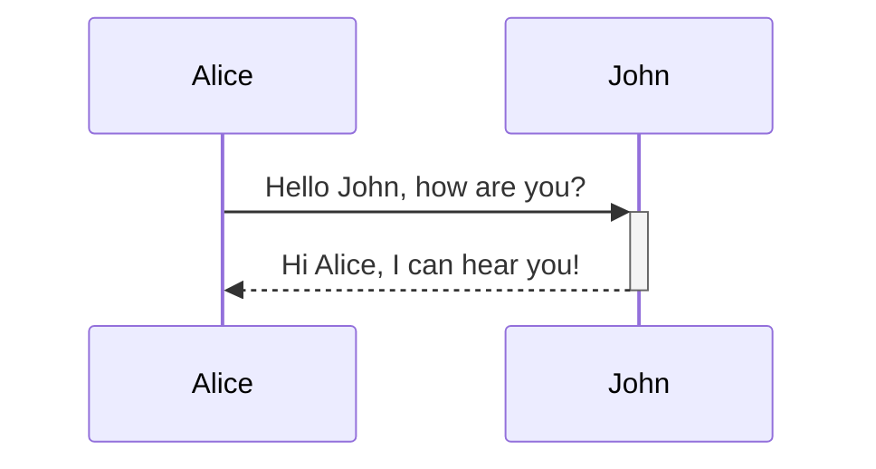
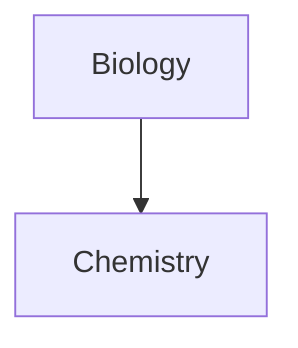

# Obsidian Markdown Syntax

Reference notes on Obsidian's markdown syntax, compiled from the official Obsidian Help docs.

Sources:
- https://obsidian.md/help/obsidian-flavored-markdown
- https://obsidian.md/help/advanced-syntax
- https://obsidian.md/help/syntax
- https://obsidian.md/help/tags
- https://obsidian.md/help/callouts
- https://obsidian.md/help/links
- https://obsidian.md/help/aliases
- https://obsidian.md/help/embeds

---

## Obsidian Flavored Markdown

Obsidian supports three markdown flavors combined: CommonMark, GitHub Flavored Markdown, and LaTeX — the goal is "maximum capability without breaking any existing formats."

**Important limitation:** Obsidian does not render markdown syntax inside HTML elements (`<div>`, `<span>`, `<table>`, etc.). E.g. `**bold**` won't format inside an HTML tag.

Obsidian's markdown extensions beyond standard markdown:

| Syntax | Purpose |
|--------|---------|
| `[[Link]]` | Internal links |
| `![[Link]]` | Embed files |
| `![[Link#^id]]` | Block references |
| `^id` | Define a block reference |
| `[^id]` | Footnotes |
| `%%Text%%` | Comments |
| `~~Text~~` | Strikethrough |
| `==Text==` | Highlight text |
| ` ``` ` | Code blocks |
| `- [ ]` | Incomplete task |
| `- [x]` | Completed task |
| `> [!note]` | Callouts |

---

## Basic Syntax

### Paragraphs & Line Breaks

Separate blocks of text with blank lines. Multiple adjacent spaces collapse into a single space in reading view — use `&nbsp;` or `<br>` to preserve spacing.

- Single `Enter`: continues the same paragraph
- Two trailing spaces + `Enter`: line break within a paragraph
- `Shift+Enter`: inserts a line break directly
- Double `Enter`: new paragraph

With **Strict Line Breaks** enabled (Settings > Editor):
- Single return, no trailing spaces: lines combine
- Single return, 2+ trailing spaces: line break (`<br>`)
- Double return: separate paragraphs (`<p>`)

### Headings

```md
# Heading 1
## Heading 2
### Heading 3
```
(1–6 `#` symbols before the text.)

### Text Formatting

| Style | Syntax | Example |
|-------|--------|---------|
| Bold | `** **` or `__ __` | `**Bold text**` |
| Italic | `* *` or `_ _` | `*Italic text*` |
| Strikethrough | `~~ ~~` | `~~Striked out text~~` |
| Highlight | `== ==` | `==Highlighted text==` |
| Bold + Italic | `*** ***` | `***Bold and italic text***` |

Escape formatting with a backslash: `\*\*Not bold\*\*`

### Links (basic)

Internal (wikilink):
```md
[[Three laws of motion]]
```

External:
```md
[Obsidian Help](https://help.obsidian.md)
```

URLs with spaces — use `%20` or angle brackets:
```md
[My Note](obsidian://open?vault=MainVault&file=My%20Note.md)
[My Note](<obsidian://open?vault=MainVault&file=My Note.md>)
```

### External Images

```md


```
Specify dimensions with `|widthxheight`, or just `|width` to scale proportionally.

### Quotes

```md
> Human beings face ever more complex and urgent problems...
> - Doug Engelbart, 1961
```
Add `[!info]` as the first line to convert a quote into a callout.

### Lists

Unordered:
```md
- First item
- Second item
```

Ordered:
```md
1. First item
2. Second item
```

Task lists:
```md
- [x] Completed task
- [ ] Incomplete task
```
Any character in the brackets marks it "complete" for styling purposes: `[x]`, `[?]`, `[-]`.

Nested lists (use `Tab` / `Shift+Tab` to indent/unindent):
```md
1. First item
   1. Nested ordered
2. Second item
   - Nested unordered
```

### Horizontal Rules

```md
***
---
___
```
Three or more of the same symbol, optionally space-separated.

### Code

Inline:
```md
Text with `backticks` for code.
``code with backtick ` inside``
```

Code blocks (indent with `Tab`/4 spaces, or fence with triple backticks; add a language after the opening fence for syntax highlighting):
```js
function fancyAlert(arg) {
  if(arg) { $.facebox({div:'#foo'}) }
}
```

Nested code blocks — use 4+ backticks/tildes for the outer fence:
````md
```js
console.log("Hello world")
```
````

### Footnotes

```md
This is a footnote[^1].
[^1]: This is the referenced text.
[^2]: Spans multiple lines with 2 spaces at start of new lines.
```

Inline footnotes (reading view only):
```md
You can use inline footnotes. ^[This is an inline footnote.]
```

### Comments

```md
This is an %%inline%% comment.
%% Block comment spanning
multiple lines %%
```
Visible only in editing view.

### Escaping Markdown

Place `\` before a special character to render it literally:
```md
\*Not italicized\*
1\. Not a list item
```
Common characters to escape: `*`, `_`, `#`, `` ` ``, `|`, `~`

---

## Advanced Syntax

### Tables

Use `|` for columns and `-` for the header row. Vertical bars on the outer edges are optional but recommended for readability.

```md
| First name | Last name |
| ---------- | --------- |
| Max        | Planck    |
| Marie      | Curie     |
```

Alignment — add colons to the header row:
```md
Left-aligned text | Center-aligned text | Right-aligned text
:-- | :--: | --:
Content | Content | Content
```

Basic markdown formatting works inside cells. Escape a literal `|` (e.g. inside an alias or a resized image embed) with `\|`:
```md
First column | Second column
-- | --
[[Basic formatting syntax\|Markdown syntax]] | ![[Engelbart.jpg\|200]]
```

### Diagrams (Mermaid)

Use a `mermaid` code block. Supports flow charts, sequence diagrams, timelines, etc.

Sequence diagram:


Flowchart:


Internal links inside a diagram — attach the `internal-link` class to a node:


### Math (MathJax / LaTeX)

Display math (double `$`):
```md
$$\begin{vmatrix}a & b\\ c & d \end{vmatrix}=ad-bc$$
```

Inline math (single `$`):
```md
This is an inline math expression $e^{2i\pi} = 1$.
```

---

## Tags

Create a tag with `#` followed by a keyword, e.g. `#meeting`. Tags can also be set via the `tags` property in YAML frontmatter as a list.

Finding tagged notes:
- Search plugin using the `tag:` operator, e.g. `tag:#meeting`
- Clicking a tag directly in a note
- The Tags view (via Command palette)

Nested tags use `/` to build a hierarchy, e.g. `#inbox/to-read`. Searching a parent tag (`tag:inbox`) matches the parent and all children; the Tags view groups nested tags under their parent.

Formatting rules:
- Valid characters: letters, numbers, underscores, hyphens, forward slashes, and Unicode (including emoji)
- Must contain at least one non-numerical character — `#1984` is invalid, `#y1984` is valid
- Case-insensitive (display preserves the casing used when first created)
- No blank spaces allowed
- For multi-word tags use camelCase, PascalCase, snake_case, or kebab-case

---

## Callouts

Turn a blockquote into a callout by adding `[!type]` as the first line.

```md
> [!info]
> Here's a callout block.
> It supports **Markdown**, [[Internal links|Wikilinks]], and [[Embed files|embeds]]!
```

**Custom title** — add text after the type identifier:
```md
> [!tip] Callouts can have custom titles
> Like this one.
```
A callout can also be title-only (no body).

**Foldable callouts** — add `+` (expanded by default) or `-` (collapsed by default) after the type:
```md
> [!faq]- Are callouts foldable?
> Yes! In a foldable callout, the contents are hidden when collapsed.
```

**Nested callouts** — supported via additional `>` levels.

**Supported types** (case-insensitive; unsupported types fall back to `note`):

- `note` (default)
- `abstract` (aliases: `summary`, `tldr`)
- `info`
- `todo`
- `tip` (aliases: `hint`, `important`)
- `success` (aliases: `check`, `done`)
- `question` (aliases: `help`, `faq`)
- `warning` (aliases: `caution`, `attention`)
- `failure` (aliases: `fail`, `missing`)
- `danger` (alias: `error`)
- `bug`
- `example`
- `quote` (alias: `cite`)

Callout appearance can be customized via CSS (`--callout-color`, `--callout-icon`), supporting Lucide icons or SVG.

---

## Links (internal, detailed)

**Wikilink format** (default, compact):
```md
[[Three laws of motion]]
[[Three laws of motion.md]]
```

**Markdown link format** (more interoperable outside Obsidian):
```md
[Three laws of motion](Three%20laws%20of%20motion)
[Three laws of motion](Three%20laws%20of%20motion.md)
```
Both formats render identically and link to the same note.

**Folder paths** — include the path before the note name, forward slashes on all platforms:
```md
[[Projects/Three laws of motion]]
[Three laws of motion](Projects/Three%20laws%20of%20motion.md)
```

**Linking to headings:**
```md
[[#Preview a linked file]]                                  <!-- same note -->
[[About Obsidian#Links are first-class citizens]]            <!-- another note -->
[[Help and support#Questions and advice#Report bugs and request features]]  <!-- subheading -->
[[## team]]                                                   <!-- search all headers containing "team" -->
```

**Linking to blocks** — use `#^` plus a block ID:
```md
[[2023-01-01#^37066d]]
```
Custom human-readable block IDs may use Latin letters, numbers, and dashes only, e.g. `^quote-of-the-day`.

**Customizing display text:**
```md
[[Example|Custom name]]
[[Example#Details|Section name]]
[Custom name](Example.md)
[Section name](Example.md#Details)
```

**Invalid characters in link destinations:** `# | ^ : %% [[ ]]`

---

## Aliases

Aliases let a note be referenced by alternate names — useful for acronyms, nicknames, or multi-language titles.

Set via the note's YAML frontmatter properties:
```md
---
aliases:
- Doggo
- Woofer
- Yapper
---
```

To link using an alias: start typing the alias inside `[[ ]]`, pick it from the suggestion list (marked with a curved-arrow icon), and press Enter. Obsidian writes it out as `[[Artificial Intelligence|AI]]` rather than just `[[AI]]`, which keeps compatibility with other wikilink-based apps.

The Backlinks pane can surface unlinked mentions of an alias elsewhere in the vault; converting one into a link automatically displays the alias as the link's custom text.

If you only need custom display text in one specific spot, use link display text (`[[Note|Display text]]`) instead of defining a vault-wide alias.

---

## Embeds

Add `!` before an internal link to embed the target's content: `![[file]]`

**Notes:**
```md
![[Internal links]]                          <!-- whole note -->
![[Internal links#Link to a heading]]         <!-- specific heading -->
![[Internal links#^b15695]]                   <!-- specific block -->
```

**Images:**
```md
![[Engelbart.jpg]]                 <!-- basic embed -->
![[Engelbart.jpg|100x145]]         <!-- custom width x height -->
![[Engelbart.jpg|100]]             <!-- width only, scales proportionally -->
  <!-- external image -->
```

**Audio:**
```md
![[Excerpt from Mother of All Demos (1968).ogg]]
```

**PDFs:**
```md
![[Document.pdf]]              <!-- basic embed -->
![[Document.pdf#page=3]]       <!-- specific page -->
![[Document.pdf#height=400]]   <!-- custom height -->
```

**Canvas:**
```md
![[My canvas.canvas]]
```
Note: embedded canvases display shapes but not the text inside cards.

**Lists** — the list needs a block identifier:
```md
- list item 1
- list item 2
^my-list-id
```
Then embed it:
```md
![[My note#^my-list-id]]
```

---

## Notes

- Last updated: 2026-08-13
- Compiled from the official Obsidian Help site (obsidian.md/help). Refer back to the source URLs above for the latest/full detail, since this is a condensed reference.
